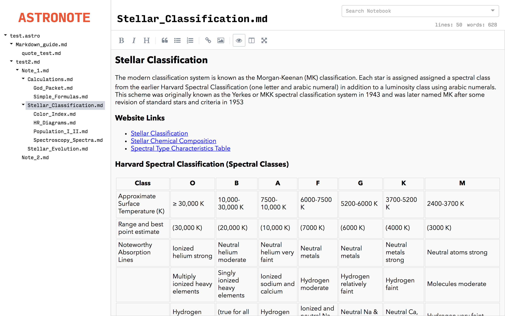

# Astronote
> Markdown notebook with link archiving

**DO NOT USE** This project is no longer maintained and has many bugs & vulnerabilities.

A minimal features, maximum memory footprint markdown-based note taking app with automatic link archiving.
Made by CQCumbers for Science Olympiad Astronomy notes. Note to self: Every version increment, remember to create new release draft and update version numbers in package.json and appveyor.yml - see [electron-builder wiki](https://www.electron.build/publishing-artifacts)

Based on [electron-with-create-react-app](https://medium.freecodecamp.com/building-an-electron-application-with-create-react-app-97945861647c), [simplemde](https://github.com/benrlodge/react-simplemde-editor), and [react-ui-tree](https://github.com/pqx/react-ui-tree), among others.

